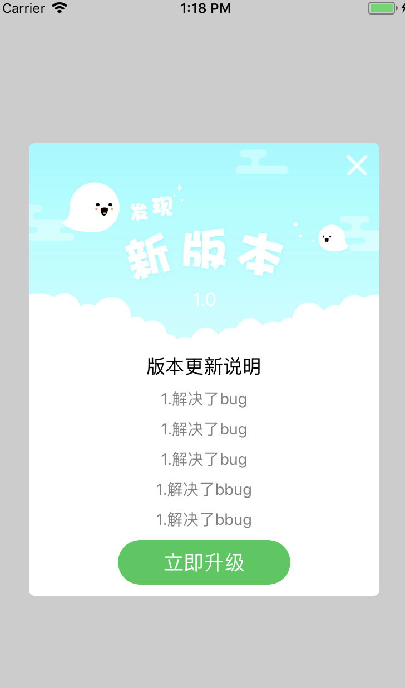

# YCheckVersionView

 自定义的检查新版本弹出视图，可以配置外观。

演示图：




使用方式：

#### 1.直接调用显示方法

```objc

    let view = YCheckVersionView(updatedDelArray: ["1.解决了bug","1.解决了bug","1.解决了bug","1.解决了bbug","1.解决了bbug"], isForcedUpdate: false, versionStr: "1.0", updateURLString: "http://www.baidu.com")
    view.show()
    
```
#### 2.根据需要配置显示的外观
``` objc

    let view = YCheckVersionView(updatedDelArray: ["1.解决了bug","1.解决了bug","1.解决了bug","1.解决了bbug","1.解决了bbug"], isForcedUpdate: false, versionStr: "1.0", updateURLString: "http://www.baidu.com")
    view.show()
    view.topImage = "test" //设置顶部显示的图片
    view.updateBtnBgColor = UIColor.red //设置升级按钮背景
    
```

如果你在使用中遇到了什么问题，或者希望扩展其他功能，可以直接跟我联系。

更多功能敬请期待！ 
